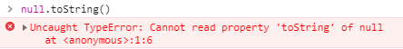

# JavaScript相关知识点集锦(一)：数据类型

## 前言
> JavaScript是每个前端开发人员的基础，但是许多知识点会经常遗忘，所以就有了这一系列的文章来整理与总结，用来加深我的理解与学习
<!--more-->
## 数据类型

> JavaScript的数据类型分为两类：原始类型（primitive type)和对象类型（object type）

### 原始类型

>原始类型有哪几种？
- number
- string
- null
- undefined
- boolean
- symbol

首先原始类型存储的都是值，所以并不能调用函数，比如`null.toString()`：



可能你会有点奇怪，为什么`'1'.toSring()`可以调用。这是因为，在这种情况下，`'1'`已经被强转化为`String`类型也就是对象类型了，所以是可以调用`toSring()`函数的。

总的来说，`number`、`string`、`boolean`都有对应的函数方法可以调用，因为它们都有对应的对象类型`Number`、`String`、`Boolean`对象，当然对象是有函数调用的；而`null`、`undefined`是没有函数调用的；


### 对象类型
> 对象类型与原始类型主要有哪些区别？

在JS中，当然除了原始类型其他都是对象类型。对象类型与原始类型主要不同是，对象类型存储的是地址（指针），而原始类型存储的是值。

当你创建一个对象类型的时候，计算机就会在内存中开辟一个空间用来存储这些值，但是我们需要找到这个空间，就需要这个空间的地址(一个指针)

```
const a = {}
```
对于常量`a`来说，假设内存地址为`#001`，那么在地址`#001`的位置放了值`{}`，常量`a`存放了地址(指针)`#001`，接下来：
```
const a = {}
const b = a
a.k = 'obj'
```
当我们赋值给另一个变量时，其实复制的原本变量是地址(指针)，也就是说变量`b`存放的是地址(指针)`#001`。当我们进行修改的时候，就会修改存放在地址(指针)`#001`上的值，所以导致了`a`、`b`两个变量的值改变。

接下来我们来看函数参数是对象的情况：

```
function person(p) {
    p.age = 24
    p = {
        name: 'Tom',
        age: 30
    }
    return p
}

const p1 = {
    name: 'Mike',
    age: 18
}

const p2 = person(p1)
console.log(p1) // {name: "Mike", age: 24}
console.log(p2) // {name: "Tom", age: 30}

```

为什么结果是那样的呢？
- 首先，函数传参传的是指针的副本
- 到函数内部修改参数属性时，`p1`也被修改了
- 但是当我们重新为`p`分配一个对象时，`p`拥有了一个新的地址(指针)，但和`p1`并没有什么关系，最终导致了两个变量的值并不相同

本文完， 感谢阅读。
