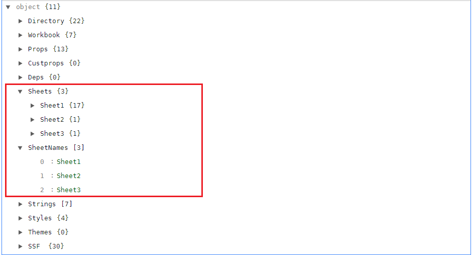
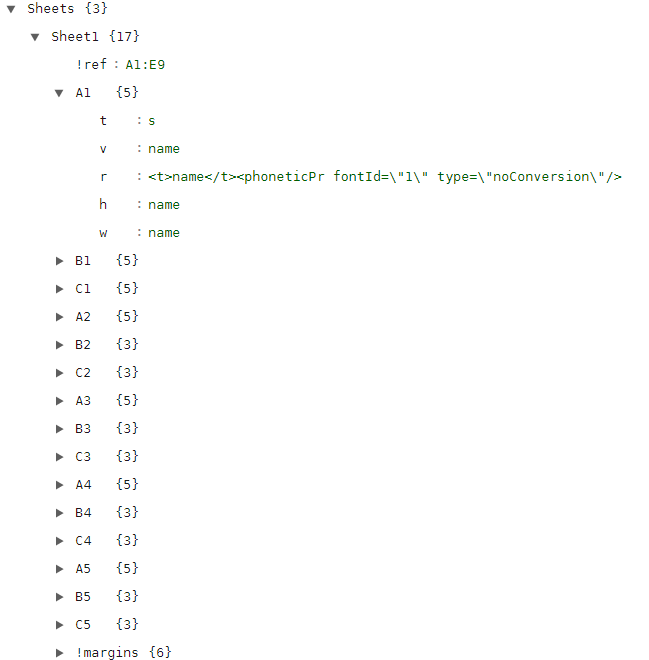

# 真实业务系列：在浏览器中使用 js-xlsx ，实现纯前端解析Excel文件，实现批量导入功能

> 博客好久之前就已经搭建好了，但是一直没有写任何东西。这样不行啊，还是要逼自己一把。写什么呢？这是个非常头疼的事情，一来没什么文笔，二来自身技术底蕴略有不足。思前考后，最终在整理笔记的时候决定先弄个 **真实业务系列**，比如 js-xlsx 实现批量导入功能、JS 生成颜色渐变等

<!-- more -->

# 为什么要用 js-xlsx

1. 实际开发中，经常会遇到批量导入（导入 Excel）的功能，特别是后台管理系统；
2. js-xlsx 是由[SheetJS](https://sheetjs.com/)出品的一款非常方便、多格式支持、纯 JS 且兼容性强的解析和导出工具库，能同时运行在浏览器端和服务器端，本文都是以浏览器端为例；

# 如何使用

> - 官方 GitHub：https://github.com/SheetJS/js-xlsx
> - 本文配套 Demo：https://ruizer.github.io/demo/#/xlsx

在浏览器中，只需要添加 script 脚本（官方 GitHub 上即可下载）：

```
<script type="text/javascript" src="dist/xlsx.full.min.js"></script>
```

| CND      | 网址                                     |
| -------- | ---------------------------------------- |
| unpkg    | https://unpkg.com/xlsx/                  |
| jsDelivr | https://jsdelivr.com/package/npm/xlsx    |
| CDNjs    | http://cdnjs.com/libraries/xlsx          |
| packd    | https://bundle.run/xlsx@latest?name=XLSX |

当然也可以用==npm==、==bower==

```
npm install xlsx
bower install js-xlsx
```

# 解析 Excel

浏览器端解析 Excel 主要是通过 XLSX.read(data,read_opts)来实现，返回一个 WorkBook 对象，然后对 WorkBook 对象进行处理；
read_opts 参数：type、raw、codepage 等，具体可见[options](https://github.com/SheetJS/js-xlsx#parsing-options)

type 为读取方式：

> - base64：base64 编码
> - binary：二进制字符串
> - string：JS 字符串
> - buffer：nodejs Buffer
> - array：8 位无符号整数数组
> - file：将读取的文件的路径（仅限 nodejs）

## 获取 WorkBook 对象

```

// 读取本地文件
readFileForWorkbook(file) {
    return new Promise((resolve, reject) => {
        const reader = new FileReader();
        let wb;
        reader.onload = res => {
          const data = res.target.result;
          wb = XLSX.read(data, {
            type: "binary"
          });
          resolve(wb);
        };
        reader.onerror = e => {
          reject(e);
        };
        reader.readAsBinaryString(file);
     });
}
```

## 使用 WorkBook 对象

### WorkBook 对象里面到底有什么呢


可以看到 Excel 所有信息，我们主要使用 SheetNames、Sheets 对象；
SheetNames：包含所有的 Sheet 名字
Sheets：保存每个 sheet 的具体内容，每个 sheet 又是通过 A1 等键值保存每个单元格的内容


### 读取 WorkBook 对象

#### 主要的辅助函数

> - XLSX.utils.sheet_to_csv：生成 CSV
> - XLSX.utils.sheet_to_html：生成 HTML
> - XLSX.utils.sheet_to_json: 生成一个对象数组
> - XLSX.utils.sheet_to_txt：生成 UTF16 格式化文本
> - XLSX.utils.sheet_to_formulae：生成公式列表

一般使用 sheet_to_csv、sheet_to_html、sheet_to_json 这三种，to_csv 会忽略格式等信息; to_html 会保留格式，但生成的是html而不是table，有定制化需求的时候可能不太适合；使用 to_json 就能实现批量导入功能了，转成 JSON 数组传个后台

```
// 根据不同类型处理work对象
analysisWorkbook(type) {
    let list = [];
    let fun = null;
    switch (type) {
        case "csv":
          fun = XLSX.utils.sheet_to_csv;
          break;
        case "txt":
          fun = XLSX.utils.sheet_to_txt;
          break;
        case "html":
          fun = XLSX.utils.sheet_to_html;
          break;
        case "formulae":
          fun = XLSX.utils.sheet_to_formulae;
          break;
        default:
          fun = XLSX.utils.sheet_to_json;
          break;
    }
    this.workbook.SheetNames.forEach(sheet => {
        const ref = this.workbook.Sheets[sheet]["!ref"];
        if (ref) {
          list = list.concat(fun(this.workbook.Sheets[sheet]));
        }
    });
    return list;
},
```

<!-- <html>
    <body>
      <a href="javascript:;" id="demo-view" onclick="openDemo">demo预览</a> 
      <iframe src="https://ruizer.github.io/demo/#/xlsx" width="100%" height="500px" id="demo-ifame"></iframe>
      <script type="text/javascript">
        function openDemo() {
          console.log('ddddd');
        }
     </script>
</body>
</html> -->

本文完， 感谢阅读。