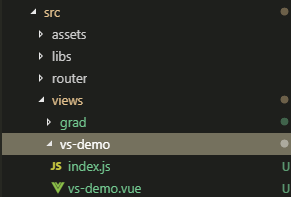

# 如何写一个命令行工具：NPM 自动生成VUE组件模板

> 命令行工具，即 Cli(command-line interface)。是在图形用户界面得到普及之前使用最为广泛的用户界面，它通常不支持鼠标，用户通过键盘输入指令，计算机接收到指令后，予以执行。

## 1 介绍
使用`vue`组件模板开发的项目每次新建组件的时候，都需要新增`.vue`文件，在这个文件当中写入`template`、`script`、`style`这些内容，并且每个人命名风格不统一，造成了很多烦恼。
本文就是通过`node`来帮助我们写一个`命令行工具`，自动去执行这些重复性工作，并保持同一种风格：


项目地址：[vue-style-cli](https://github.com/ruizer/vue-style-cli)，欢迎[star](https://github.com/ruizer/vue-style-cli)。有什么问题或者建议可以在[issues](https://github.com/ruizer/vue-style-cli/issues)提问

<!-- more -->

## 2 创建新项目

```
$ mkdir vue-style-cli
$ cd vue-style-cli
$ npm init
```
最后我们会得到一个`vue-style-cli`文件夹，并在`vue-style-cli`文件夹初始化了一个`package.json`文件。

## 新建可执行文件
我们在`vue-style-cli`文件夹下新建`index.js`文件，并在文件头部加上以下代码：

```
#!/usr/bin/env node
```
最后，制定`index.js`文件为此项目的可执行文件，在`package.json`文件中加入：

```
"bin": {
    "vs": "index.js"
 },
```
## 3 开发调试
我们全局安装一个cli包过后，可以全局调用这个命令行工具。那我们开发的时候怎么调用呢？答案很简单，使用`npm link`命令。
> 在`npm`包下执行 `npm link`，会创建一个连接符号，连接全局文件夹。这样就能进行开发调试了。
>
> 官方文档：https://docs.npmjs.com/cli/link

## 4 命令行辅助工具
在写命令行工具的时候，会使用一些辅助工具让我们的开发更高效。以下是本项目使用的一些辅助工具：

> [commander.js](https://github.com/tj/commander.js)：帮助参数解析
>
> [chalk](https://github.com/chalk/chalk)：命令行输出自定义颜色

当然还有其他比较有效的辅助工具：

> [Inquirer.js](https://github.com/SBoudrias/Inquirer.js)：常见交互式命令行
>
> [ora](https://github.com/sindresorhus/ora)：命令行动画效果
>
> [download-git-repo](https://github.com/flipxfx/download-git-repo)：下载并提取 git 仓库
>
> [log-symbols](https://github.com/sindresorhus/log-symbols)：可以在终端上显示出 √ 或 × 等的图标。

## 5 vue-style-cli主要代码逻辑

### 5.1 命令行主要代码

```
program
  .command('create <name>')
  .description('create a vue component with directory')
  .alias('c')
  .option('-p, --path [path]', 'real path; Please use relative paths')
  .option('-o,--only', 'create only component without directory')
  .option('-s,--scoped', 'Scoped CSS')
  .option('-l, --lang [lang]', 'CSS Modules')
  .action((name, cmd) => {
    try {
      cmd.only
        ? generateOnlyComponent(
            name,
            getRealPath(cmd.path),
            cmd.lang,
            cmd.scoped,
          )
        : generateComponent(name, getRealPath(cmd.path), cmd.lang, cmd.scoped);
    } catch (e) {
      console.log(e);
    }
  });
```
主要就只有一个`create`命令，带有一些`option`参数可选择：

```
--path：文件创建地址(相对地址)，没有则在当前命令执行文件夹下创建
--only：是否只创建单独的`.vue`组件，默认创建带有文件夹风格
--scoped：`.vue`组件中CSS作用域
--lang：`.vue`组件中CSS模块，默认没有
```
例子：

```
e:\demo>vs c vsDemo -p ./src/views
在E:\demo目录下执行vs c vsDemo -p ./src/views 命令，最终会在E:\demo\src\views下生成vs-demo文件夹，vs-demo文件夹里面含有index.js和vs-demo.vue两个文件
```
### 5.2 文件生成代码

```
generateOnlyComponent：生成单独的.vue文件
generateComponent：生成含有文件夹格式的.vue文件
```
这里主要介绍`generateComponent`，因为本质上`generateComponent`与`generateOnlyComponent`逻辑差不多

#### 5.2.1 使用mkdirp与tpl_apply
本作者为了快速开发(图方便)，使用了`mkdirp`与`tpl_apply`这两个库进行文件夹和文件的生成。
> [mkdirp](https://github.com/substack/node-mkdirp)：生成文件夹
>
> [tpl_apply](https://github.com/i5ting/tpl_apply)： 基于[handlebars.js](https://github.com/wycats/handlebars.js)实现文件写入

#### 5.2.2 代码逻辑
1、检查当前路径下是否存在此文件夹，若存在，报错，否则进行下一步

```
    let exists = false;
    try {
      fs.accessSync(filePath);
      exists = true;
    } catch (error) {}
    if (exists) {
      message.error(`Unable to create: ${filePath} folder already exists`);
      return resolve();
    }
```
2、在当前路径下创建文件夹，并在此文件夹下新增`.js`和`.vue`文件
```
// 创建文件夹
    mkdirp(filePath, err => {
      if (err) {
        console.error(err);
        return resolve();
      }

      const data = {
        kebabCaseName: name,
        camelCaseName: firstUpperCase(getCamelCase(name)),
        lang,
        scoped: scoped ? ' scoped' : '',
      };
      const tplPath = path.join(__dirname, '../templates');
      const tpls = [
        { source: 'vue.tpl', dest: `${name}.vue` },
        { source: 'index.tpl', dest: 'index.js' },
      ];

      tpls.forEach(({ source, dest }) => {
        tplApply.tpl_apply(
          path.join(tplPath, source),
          data,
          path.join(filePath, dest),
        );
      });

      message.success(`generate ${filePath} success`);
      resolve();
    });
```

3、模板文件

vue.tpl

```
<template>
  <div class="{{kebabCaseName}}"></div>
</template>

<script>
export default {
  name: "{{kebabCaseName}}"
};
</script>

<style{{#if lang}} lang="{{lang}}"{{/if}}{{scoped}}>
</style>

```
index.tpl

```
import {{camelCaseName}} from './{{kebabCaseName}}';

export default {{camelCaseName}};

```

## 6 发布

发布包到npm非常简单，只需要一条命令：

```
npm publish
```
详细可见：[如何发布自己的NPM包？](/2019/04/30/publish-npm-package/)

本文完， 感谢阅读。