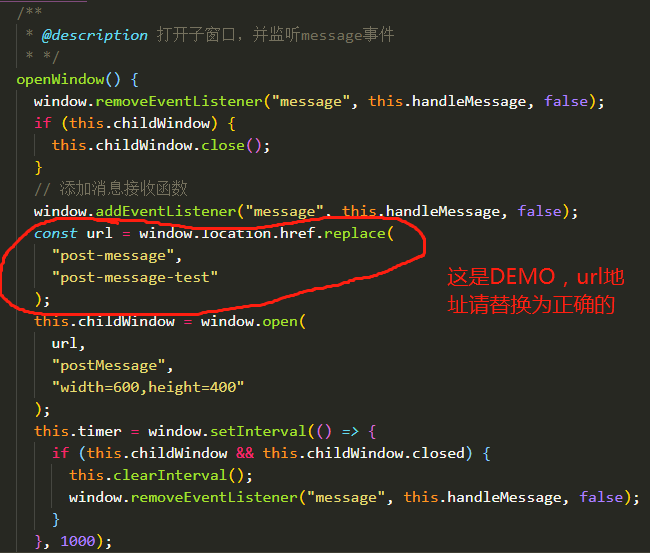
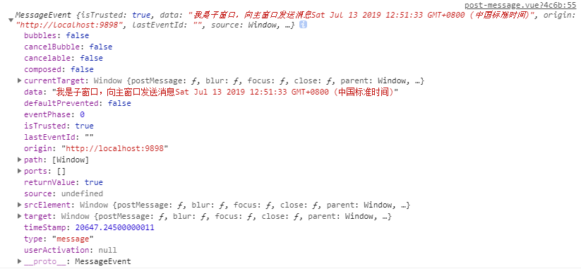
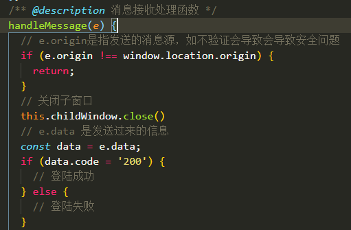

# 利用 postMessage 的骚操作来实现微信网页授权登陆
>这是我很久以前写的文章，如果有什么不对的地方请指出，原文：[https://ruizer.github.io/2019/07/13/window-post-message-for-wechat-login/](https://ruizer.github.io/2019/07/13/window-post-message-for-wechat-login/)

> 之前对于postMessage并不是特别熟悉，只是看过文档、写过demo。但这次在做微信网页授权登陆的时候，用到了postMessage，用得并不是很顺手，所以想着写篇文章记录一下，并且也重新写了个[demo](https://ruizer.github.io/demo/#/post-message)，源码：[post-message][postmessage]

## postMessage概念
`window.postMessage()` 方法可以安全地实现跨源通信。通常，对于两个不同页面的脚本，只有当执行它们的页面位于具有相同的协议（通常为`https`），端口号（`443`为`https`的默认值），以及主机  (两个页面的模数 `Document.domain` 设置为相同的值) 时，这两个脚本才能相互通信。`window.postMessage()` 方法提供了一种受控机制来规避此限制，只要正确的使用，这种方法就很安全。
<!--more-->

`window.postMessage()` 方法被调用时，会在所有页面脚本执行完毕之后（e.g., 在该方法之后设置的事件、之前设置的 `timeout` 事件,etc.）向目标窗口派发一个 `MessageEvent` 消息。 该   `MessageEvent` 消息有四个属性需要注意： `message` 属性表示该`message` 的类型； `data` 属性为 `window.postMessage` 的第一个参数；`origin` 属性表示调用 `window.postMessage()` 方法时调用页面的当前状态； `source` 属性记录调用 `window.postMessage()` 方法的窗口信息。

## 大体思路

做过微信网页授权的人应该都知道，用户扫码过后，微信后台与我们的后台会有一个响应。但对于前后端分离项目，我们的后台只能做重定向的操作才能让前端知道用户使用微信登陆成功了（如果你在前端做定时任务一直刷新，当我没说。再者登陆内嵌存在多个页面中，并且登陆成功后需要获取多个数据，这时候后台直接重定向就不是太方便了。

所以，这时候我们需要一个专门做登陆验证的页面，后台重定向到这个页面，然后利用 `postMessage` 进行通信，告诉我们用户微信登陆成功了，可以获取一些数据了

## 父窗口
> 网页接入微信登陆的时候，登陆页面即为父窗口。

首先，当用户点击微信登陆时，使用`window.open()`打开一个子窗口，并监听message事件，子窗口链接就是微信提供的链接，地址可见[网站应用微信登录开发指南][WeChatLoginURI]


可以看见，图中有个`setInterval`定时任务，这是为了监听子窗口关闭后清除`message`监听事件

`handleMessage`就是消息接收处理函数，它会接收一个参数`e`，`e`是一个对象：


一般会用到 `origin` 和 `data`
- `origin`是发送的消息源，用来验证消息是从哪个地方发送过来的，一定要验证，若不是你定义的源则不能接收处理这个消息
- `data`是发送的数据，在这里你可以拿到微信登陆重定向页面给你发过来的数据，判断用户是否登陆。


## 子窗口
> 微信二维码页面、重定向页即为子窗口

当然微信二维码页面我们是做不了任何操作的，因为这是微信内部代码，也不在同个域。但是用户扫码授权登陆后重定向至我们自定义的重定向页，这时候我们可以在重定向页面向父窗口（即登录页）传递信息，父窗口可以根据这些信息知道用户是否登陆了，并进行相应的操作。

什么时候传递信息呢？我们可以把登陆成功信息拼接在重定向地址上面，前端解析地址得到信息后就可以把这些信息传递给父窗口：
```
// 先解析地址，得到数据，然后使用 window.opener.postMessage 传递数据
window.opener.postMessage(数据, window.location);
```

本文完， 感谢阅读。

[WeChatLoginURI]:https://open.weixin.qq.com/cgi-bin/showdocument?action=dir_list&t=resource/res_list&verify=1&id=open1419316505&token=&lang=zh_CN
[postmessage]:https://github.com/ruizer/demo/blob/master/src/views/post-message/post-message.vue
