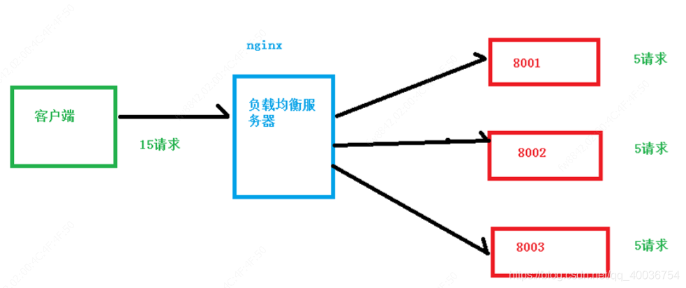
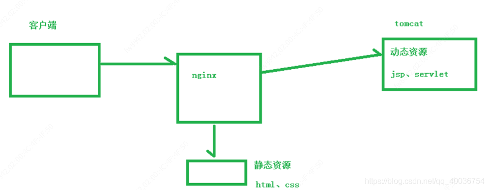

# nginx学习，看这一篇就够了
> 非常棒的文章，这边做个缓存，防止丢失，原文：[https://blog.csdn.net/qq_40036754/article/details/102463099](https://blog.csdn.net/qq_40036754/article/details/102463099)

## 一、nginx简介

### 1. 什么是 nginx 和可以做什么事情
- Nginx 是高性能的 HTTP 和反向代理的web服务器，处理高并发能力是十分强大的，能经受高负 载的考验,有报告表明能支持高达 50,000 个并发连接数。
- 其特点是占有内存少，并发能力强，事实上nginx的并发能力确实在同类型的网页服务器中表现较好，中国大陆使用nginx网站用户有：百度、京东、新浪、网易、腾讯、淘宝等。

### 2.Nginx 作为 web 服务器
- Nginx 可以作为静态页面的 web 服务器，同时还支持 CGI 协议的动态语言，比如 perl、php 等。但是不支持 java。Java 程序只能通过与 tomcat 配合完成。Nginx 专为性能优化而开发， 性能是其最重要的考量,实现上非常注重效率 ，能经受高负载的考验,有报告表明能支持高 达 50,000 个并发连接数。

https://lnmp.org/nginx.html

### 3. 正向代理
Nginx 不仅可以做反向代理，实现负载均衡。还能用作正向代理来进行上网等功能。 **正向代理：如果把局域网外的 Internet 想象成一个巨大的资源库，则局域网中的客户端要访 问 Internet，则需要通过代理服务器来访问，这种代理服务就称为正向代理。**
- 简单一点：通过代理服务器来访问服务器的过程 就叫 正向代理。
- 需要在客户端配置代理服务器进行指定网站访问

### 4. 反向代理
- 反向代理，其实客户端对代理是无感知的，因为客户端不需要任何配置就可以访问。
- 我们只需要将请求发送到反向代理服务器，由反向代理服务器去选择目标服务器获取数据后，在返回给客户端，此时反向代理服务器和目标服务器对外就是一个服务器，暴露的是代理服务器地址，隐藏了真实服务器`IP`地址。

### 5. 负载均衡

- 增加服务器的数量，然后将请求分发到各个服务器上，将原先请求集中到单个服务器上的 情况改为将请求分发到多个服务器上，将负载分发到不同的服务器，也就是我们所说的`负载均衡`
- 客户端发送多个请求到服务器，服务器处理请求，有一些可能要与数据库进行交互，服务器处理完毕后，再将结果返回给客户端。

这种架构模式对于早期的系统相对单一，并发请求相对较少的情况下是比较适合的，成本也低。但是随着信息数量的不断增长，访问量和数据量的飞速增长，以及系统业务的复杂度增加，这种架构会造成服务器相应客户端的请求日益缓慢，并发量特别大的时候，还容易造成服务器直接崩溃。很明显这是由于服务器性能的瓶颈造成的问题，那么如何解决这种情况呢？

我们首先想到的可能是升级服务器的配置，比如提高` CPU `执行频率，加大内存等提高机器的物理性能来解决此问题，但是我们知道摩尔定律的日益失效，硬件的性能提升已经不能满足日益提升的需求了。最明显的一个例子，天猫双十一当天，某个热销商品的瞬时访问量是极其庞大的，那么类似上面的系统架构，将机器都增加到现有的顶级物理配置，都是不能够满足需求的。那么怎么办呢？上面的分析我们去掉了增加服务器物理配置来解决问题的办法，也就是说纵向解决问题的办法行不通了，那么横向增加服务器的数量呢？这时候集群的概念产生了，单个服务器解决不了，我们增加服务器的数量，然后将请求分发到各个服务器上，将原先请求集中到单个服务器上的情况改为将请求分发到多个服务器上，将负载分发到不同的服务器，也就是我们所说的`负载均衡`。

### 6.动静分离
为了加快网站的解析速度，可以把动态页面和静态页面由不同的服务器来解析，加快解析速度，降低原来单个服务器的压力。

## 二、Nginx 的安装
> 不同系统安装方式不一样，并不复杂。
### 防火墙问题

